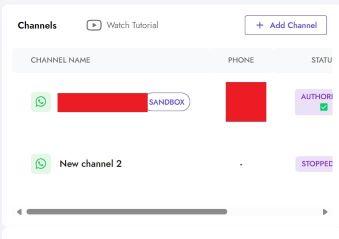

# Instructions:
1. Visit [https://panel.whapi.cloud/login](https://panel.whapi.cloud/login) and login with your credentials or Sign Up.
1. Follow the Steps to sign in to your WhatsApp.
1. Go to Dashboard [https://panel.whapi.cloud/dashboard](https://panel.whapi.cloud/dashboard)
1. Select the channel. \

1. Grab the API Token \

1. Create CSV file containing participants in the format given below and import \
